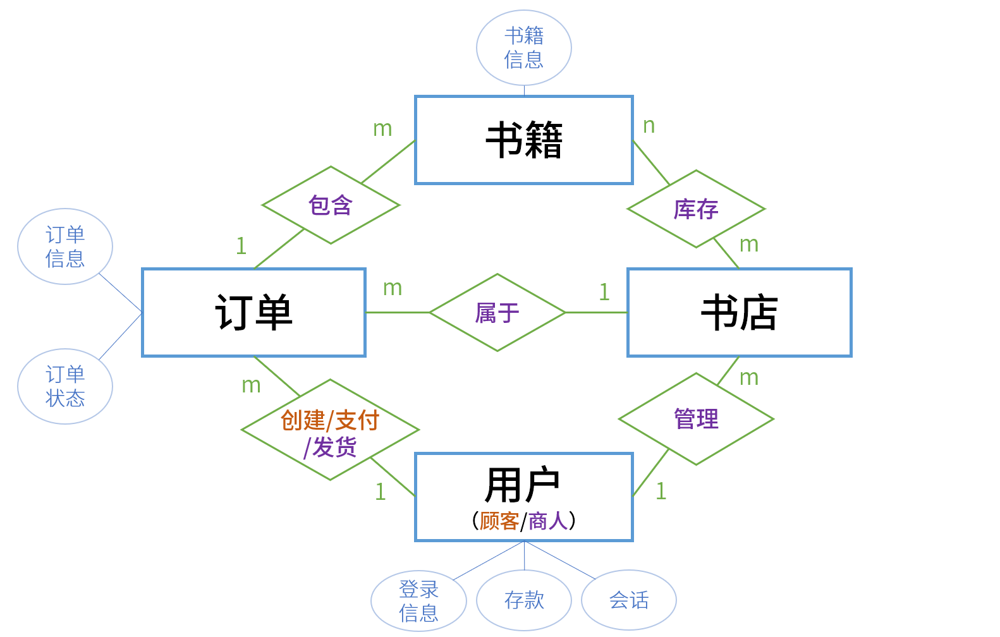

# 数据库课程第二次大作业报告

> 2023-6-8

## 一、实验过程

1. 代码仓库 Fork 自第一次大作业 [Bookstore_Eewat_mongoDB](https://github.com/PaperL/Bookstore_Eewat_MongoDB)。
2. 于本地 WSL2 Ubuntu20.04 环境部署 PostgreSQL，配置以默认优先。数据库初始化见 `bookstore/initDatabase.py` 部分代码。
3. 学习并应用 Sqlalchemy 包，实现账号相关功能。详见 [Commit 8c859a8](https://github.com/PaperL/Bookstore_Eewat_PostgreSQL/commit/8c859a806ced9b29fddcb33c24efcce9de39dd91)。
4. 完善关系数据库其他部分设计，并实现剩余功能。详见后续 [Commit](https://github.com/PaperL/Bookstore_Eewat_PostgreSQL/commits/master)。
5. 进行代码调试，并进行测试。结果见后文。

## 二、作业思路

1. 发挥 SQL 事务特性
   1. 在单一功能中尽可能减少 session 的创建，减少重复实例开销。
   2. 尽可能减少 session 生命周期，提高吞吐率。
   3. 进行分段 commit，并在异常产生处使用 rollback 功能维护数据正确性。

2. 合理设置数据关系，解耦大规模数据。
3. 保证代码质量，避免单一功能中的重复读写多行数据。读写均使用索引查找元素，防止操作复杂度暴增（从树状结构的 $O(logN)$ 增至 $O(N)$ 在大规模数据下是无法接受的）。
4. 使用 Github 维护并开源代码，保持良好的代码可读性、格式规范以及代码仓库整洁。

## 三、关系数据库设计

> 详见 `bookstore/be/model/tables.py` 及同目录 `user.py`

### ER 图

仅为示意，各实体 id、主键均省略

### 关系数据表

数据表设计如下，其中下划线表示主键，按预期访问频率分行排列：

1. ***Book Table***
   1. **<u>id</u>**
   2. title, author, publisher, original_title, translator, pub_year, pages, price, currency_unit, binding, isbn, author_intro, book_intro, content, tags, picture
2. ***User Table***
   1. **<u>user_id</u>**
   2. password, balance
   3. token, terminal
3. ***Store & Book Table***
   1. **<u>store_id</u>**, **<u>book_id</u>**
   2. book_info, stock_level
4. ***User & Store Table***
   1. **<u>user_id</u>**, **<u>store_id</u>**
5. ***New Order Table***
   1. **<u>order_id</u>**
   2. user_id, store_id
   3. order_time, total_price
   4. paid, cancelled, delivered (布尔类型表示三选一状态)
6. ***New Order Detail Table***
   1. **<u>order_id</u>**, **<u>book_id</u>**
   2. count, price

## 四、测试结果

> 测试指令 `pytest --cov`

该表包括：**前 60% 测试点全部正确通过；后 40% 测试点全部正确通过。**

`----- coverage: platform linux, python 3.11.3-final-0 -----`

| Name                     | Stmts | Miss                                                         | Cover |
| ------------------------ | ----- | ------------------------------------------------------------ | ----- |
| be/\__init__.py           | 0     | 0                                                            | 100%  |
| be/conf.py               | 1     | 0                                                            | 100%  |
| be/model/\__init__.py    | 0     | 0                                                            | 100%  |
| be/model/buyer.py        | 171   | 24                                                           | 86%   |
| be/model/database.py     | 24    | 1                                                            | 96%   |
| be/model/error.py        | 33    | 3                                                            | 91%   |
| be/model/search.py       | 42    | 8                                                            | 81%   |
| be/model/seller.py       | 86    | 16                                                           | 81%   |
| be/model/tables.py       | 96    | 0                                                            | 100%  |
| be/model/user.py         | 154   | 26                                                           | 83%   |
| be/serve.py              | 37    | 6                                                            | 84%   |
| be/view/\__init__.py     | 0     | 0                                                            | 100%  |
| be/view/auth.py          | 42    | 0                                                            | 100%  |
| be/view/buyer.py         | 50    | 0                                                            | 100%  |
| be/view/search.py        | 21    | 0                                                            | 100%  |
| be/view/seller.py        | 37    | 0                                                            | 100%  |
| fe/\__init__.py          | 0     | 0                                                            | 100%  |
| fe/access/\__init__.py   | 0     | 0                                                            | 100%  |
| fe/access/auth.py        | 32    | 0                                                            | 100%  |
| fe/access/book.py        | 64    | 0                                                            | 100%  |
| fe/access/buyer.py       | 49    | 0                                                            | 100%  |
| fe/access/new_buyer.py   | 8     | 0                                                            | 100%  |
| fe/access/new_seller.py  | 8     | 0                                                            | 100%  |
| fe/access/search.py      | 17    | 0                                                            | 100%  |
| fe/access/seller.py      | 37    | 0                                                            | 100%  |
| fe/bench/__init__.py     | 0     | 0                                                            | 100%  |
| fe/bench/run.py          | 13    | 0                                                            | 100%  |
| fe/bench/session.py      | 47    | 0                                                            | 100%  |
| fe/bench/workload.py     | 125   | 1                                                            | 99%   |
| fe/conf.py               | 11    | 0                                                            | 100%  |
| fe/conftest.py           | 17    | 4                                                            | 76%   |
| fe/test/gen_book_data.py           |  50   |  1   |  98%  |
| fe/test/test_add_book.py           |  36   |  0   |  100% |
| fe/test/test_add_funds.py          |  30   |  0   |  100% |
| fe/test/test_add_stock_level.py    |  42   |  0   |  100% |
| fe/test/test_bench.py              |   8   |  2   |  75%  |
| fe/test/test_book_info.py          |  25   |  0   |  100% |
| fe/test/test_cancel_order.py       |  85   |  2   |  98%  |
| fe/test/test_create_store.py       |  20   |  0   |  100% |
| fe/test/test_deliver_order.py      |  69   |  1   |  99%  |
| fe/test/test_fuzzy_search.py       |  42   |  0   |  100% |
| fe/test/test_login.py              |  28   |  0   |  100% |
| fe/test/test_new_order.py          |  40   |  0   |  100% |
| fe/test/test_password.py           |  33   |  0   |  100% |
| fe/test/test_payment.py            |  80   |  1   |  99%  |
| fe/test/test_query_orders.py       |  30   |  0   |  100% |
| fe/test/test_register.py           |  31   |  0   |  100% |
| **TOTAL**                          | **1871** |  **96**  |  **95%**  |

## 补充

- 详细接口说明文档见 `docs/docs_old`
- 模糊搜索功能为搜索书籍所有文字字段，进行模糊大小写匹配，结果分页呈现
- 订单超时后进行任一操作时自动失效
